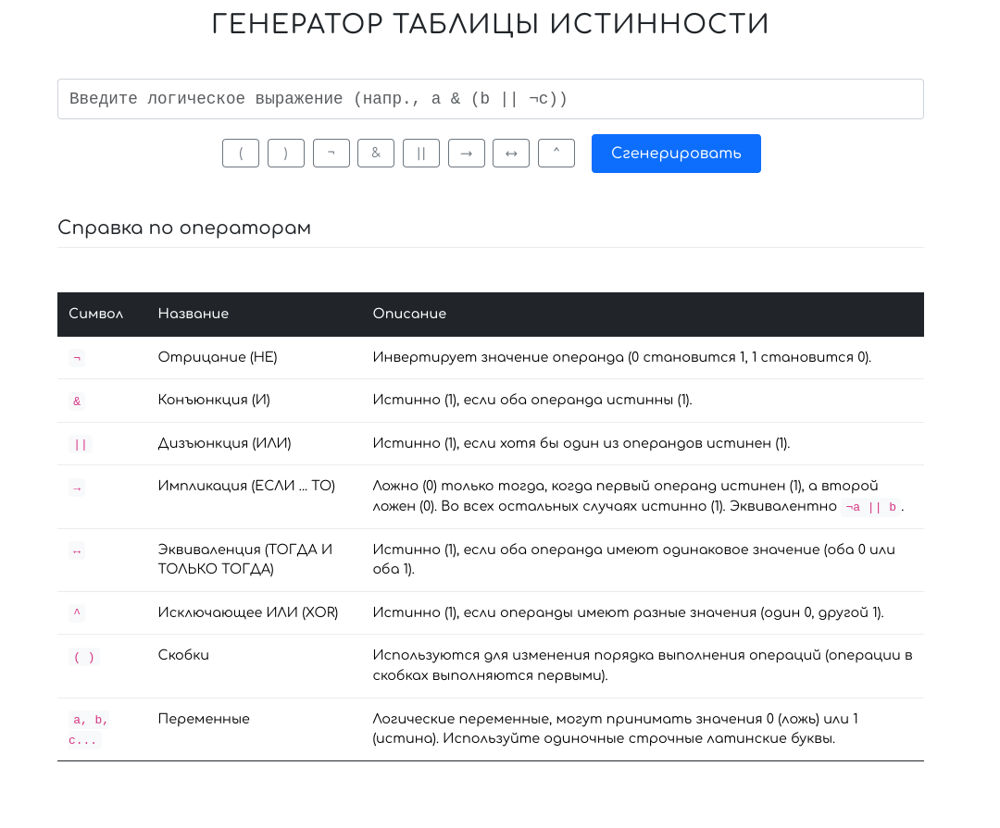

# Генератор Таблиц Истинности 📊

Простое и удобное веб-приложение для автоматического построения таблиц истинности для заданных логических выражений. Идеально подходит для студентов, изучающих дискретную математику и логику, а также для всех, кому нужно быстро проверить или визуализировать логические операции.

## ✨ Возможности

*   **Интерактивный ввод:** Вводите логические выражения с помощью клавиатуры или удобных экранных кнопок для операторов.
*   **Поддержка основных операторов:** Работает с отрицанием (`¬`), конъюнкцией (`&`), дизъюнкцией (`||`), импликацией (`→`), эквиваленцией (`↔`) и исключающим ИЛИ (`^`).
*   **Автоопределение переменных:** Автоматически находит все переменные (одиночные строчные латинские буквы) в выражении.
*   **Пошаговое вычисление:** Отображает не только конечный результат, но и значения всех промежуточных подвыражений, помогая понять процесс вычисления.
*   **Генерация таблицы:** Строит полную таблицу истинности со всеми возможными комбинациями значений переменных.
*   **Встроенная справка:** Содержит краткое описание всех поддерживаемых логических операторов.
*   **Обработка ошибок:** Выводит понятные сообщения при некорректном вводе выражения.
*   **Адаптивный дизайн:** Корректно отображается на различных устройствах благодаря Bootstrap 5.
*   **Чистый интерфейс:** Современный и понятный дизайн для комфортной работы.

## 🛠️ Поддерживаемые операторы

*   `¬` - Отрицание (НЕ)
*   `&` - Конъюнкция (И)
*   `||` - Дизъюнкция (ИЛИ)
*   `→` - Импликация
*   `↔` - Эквиваленция
*   `^` - Исключающее ИЛИ (XOR)
*   `( )` - Скобки для группировки

*(Примечание: Переменные должны быть одиночными строчными латинскими буквами, например: `a`, `b`, `p`, `q`)*

## 🚀 Как использовать

1.  **Откройте `index.html`** в вашем веб-браузере (или перейдите по данной ссылке logic-calc.vercel.app).
2.  **Введите логическое выражение** в поле ввода. Вы можете использовать кнопки для вставки операторов.
    *   *Пример:* `(a → b) ↔ (¬b → ¬a)`
3.  Нажмите кнопку **"Сгенерировать"**.
4.  Ниже появится **таблица истинности** с промежуточными шагами и конечным результатом.
5.  При необходимости обратитесь к **справке по операторам** внизу страницы.

## 💻 Технологический стек

*   HTML5
*   CSS3
*   Bootstrap 5 (для стилизации и адаптивности)
*   Vanilla JavaScript (ES6+)
    *   Собственный токенизатор и вычислитель выражений (алгоритм на стеках, похожий на Shunting-yard для вычисления).

## 💡 Возможные улучшения (Future Plans)

*   Поддержка логических констант (0/1) в выражении.
*   Более гибкие имена переменных (например, `p1`, `var_name`).
*   Улучшенная валидация выражений и более детальные сообщения об ошибках.
*   Возможность сохранения/загрузки часто используемых выражений.
*   Подсветка синтаксиса в поле ввода.

## 📄 Лицензия

Этот проект распространяется под лицензией MIT. Подробности см. в файле `LICENSE`.
